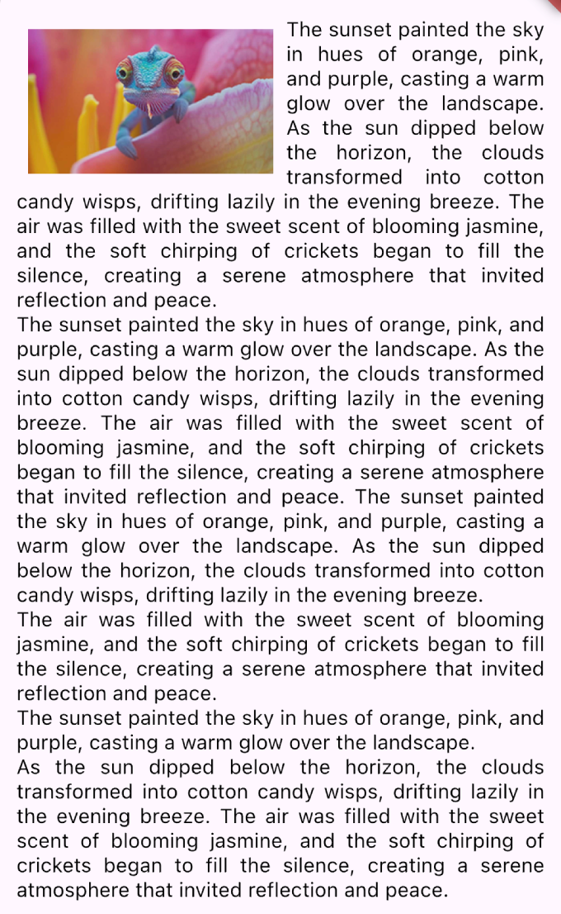

# wrapped_text_widget

A Flutter widget that allows you to wrap paragraph text around a widget (e.g., an image or custom UI block).  
It even supports dragging the widget interactively, with the text reflowing in real time.



## Features
- Wrap text dynamically around any child widget
- Supports dragging (optional)
- Customizable padding and text styles
- Handles text alignment with justification

## Getting started
Add to your `pubspec.yaml`:
```yaml
dependencies:
  wrapped_text_widget: ^0.0.1
